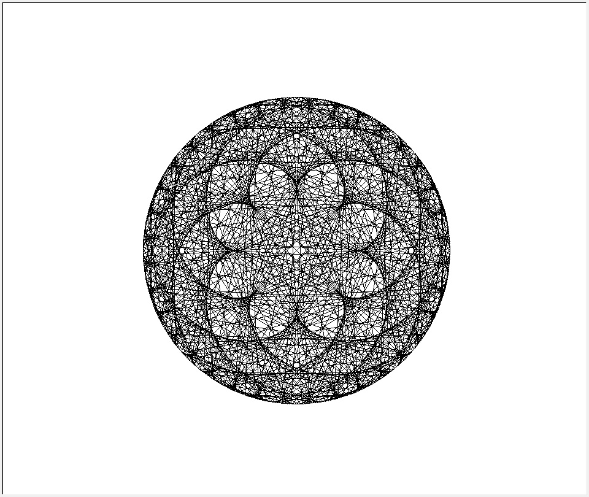

# Python-Modulo-Multiplication-Circle

This is a program that creates a representation of multiplication tables on a modulo circle.
## Features
- Visual representation
## Installation
1. Download the repository by clicking on `Code > Download ZIP`
2. Extract the ZIP file
3. Run `main.py`
## Requirements
- Python 3.7
- Python turtle library
## Usage
You have to type the number of points of the circle and the multiplication table.

For each point, the program draws a line between it and the point at its position multiplied by the table modulo the number of points.

Ex :

For the table of `3` with `10` points the program draw those lines :

- `0` to `(0 * 3) % 10` <=> `0` to `0`
- `1` to `(1 * 3) % 10` <=> `1` to `3`
- `2` to `(2 * 3) % 10` <=> `2` to `6`
- `3` to `(3 * 3) % 10` <=> `3` to `9`
- `4` to `(4 * 3) % 10` <=> `4` to `2`
- `5` to `(5 * 3) % 10` <=> `5` to `5`
- `6` to `(6 * 3) % 10` <=> `6` to `8`
- `7` to `(7 * 3) % 10` <=> `7` to `1`
- `8` to `(8 * 3) % 10` <=> `8` to `4`
- `9` to `(9 * 3) % 10` <=> `9` to `7`